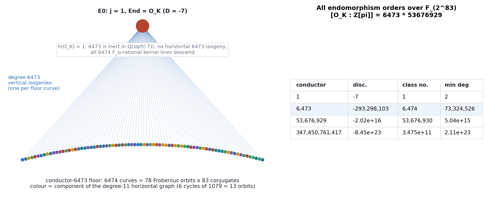
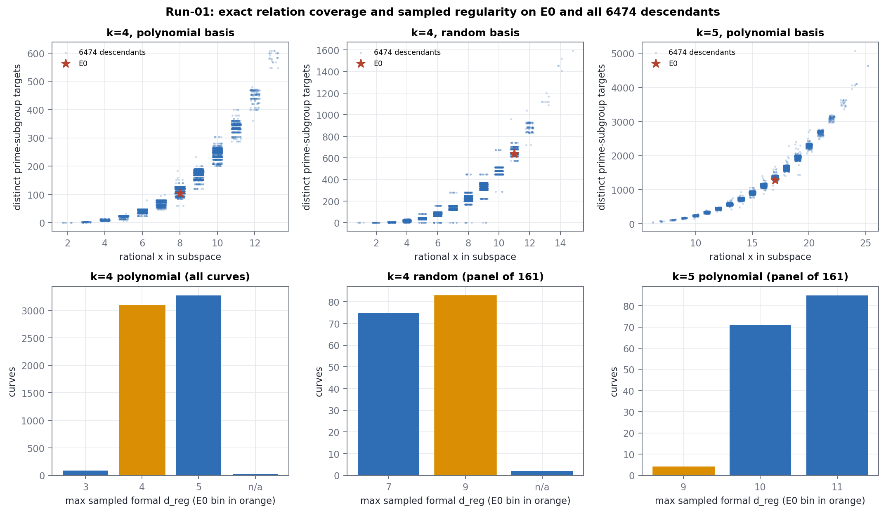
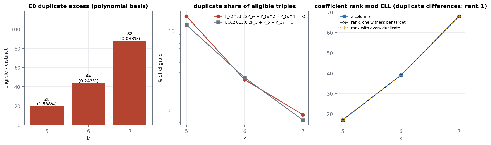
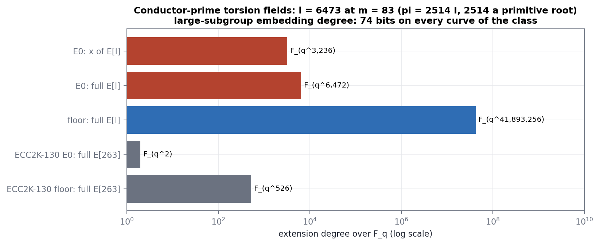
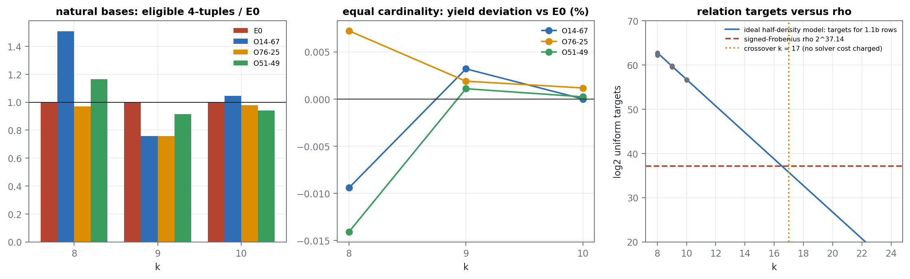
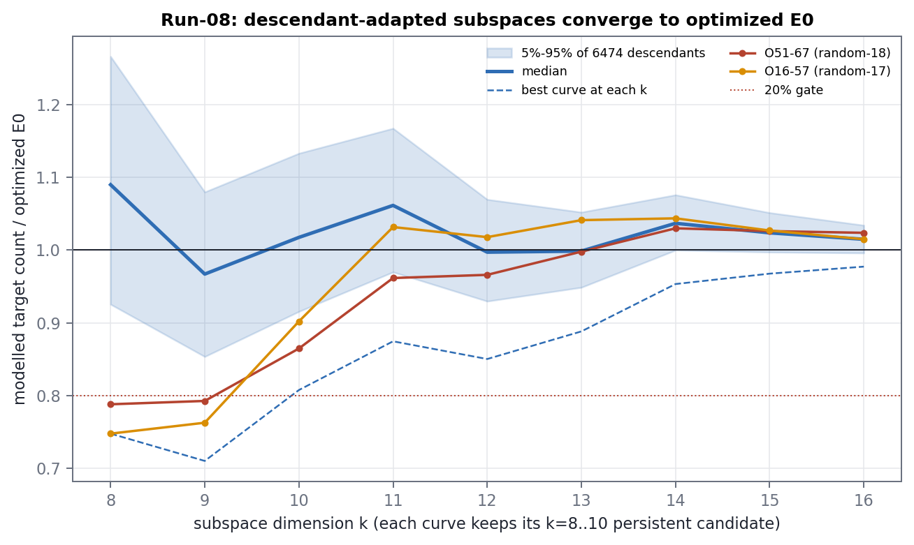
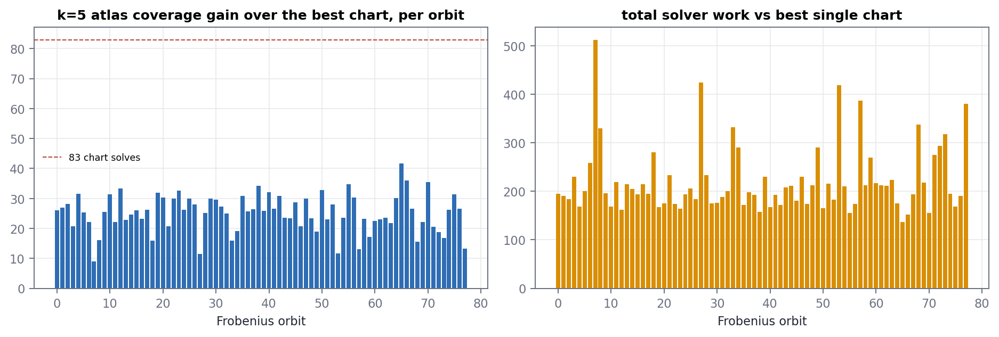
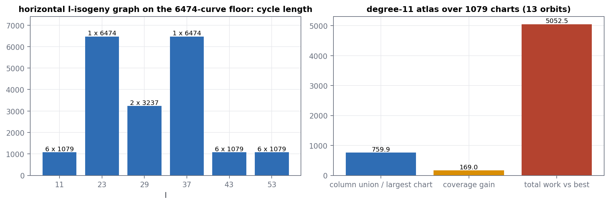

# F_(2^83) Koblitz volcano descendants


## Executive assessment


> **Security conclusion**
>
> Descending from the maximal order to the conductor-6473 floor of the F_(2^83) Koblitz curve changes the geometric endomorphism ring, the local 6473-torsion, the model field of definition and the available self-maps. As for ECC2K-130, those changes produce many finite coordinate and factor-base differences, but no tested descendant mechanism reduces complete index-calculus work. The apparent gains disappear under matched cardinality, adjacent-dimension scaling, matrix-column accounting, or map and solver cost.

The original curve E0 is the Koblitz curve `y^2 + xy = x^3 + 1` over `F_(2^83)`, the m=83 instance of this repository's ECC2K-130 client, with prime subgroup order ELL = 2,417,851,639,230,796,216,685,689 (81 bits). Its geometric endomorphism ring is the maximal order of Q(sqrt(-7)). The Frobenius order has index 347,450,761,417 = 6473 x 53676929 in O_K, and **both primes are inert**. The nearest strict descendants have conductor 6473, discriminant -293,298,103 and class number 6,474. All 6,474 floor models were constructed from a ring class polynomial, certified, and matched one-to-one against explicit degree-6473 isogenies from E0.


### Main findings

- The prime subgroup and its 74-bit embedding degree are invariant across the isogeny class; descent creates no MOV shortcut.
- Strict descendants lose E0's degree-2 Frobenius self-endomorphism. Their minimum noninteger endomorphism degree is 73,324,526, against 2 on E0 (121,046 at ECC2K-130).
- Because 6473 is inert, E0 has no horizontal 6473-isogeny: all 6,474 rational kernel lines descend, one to each floor curve. The floor is 78 Frobenius orbits of 83 conjugates (ECC2K-130: two orbits of 131).
- Frobenius acts on E0[6473] as the scalar 2514, a primitive root mod 6473, so the kernel x-coordinates live in F_(2^268588). Explicit torsion points, all 6474 Velu codomains and degree-3236 kernel polynomials were computed there with native PMULL arithmetic; the codomains reproduce the class-polynomial inventory exactly.
- Exact relation images on all 32,375 curve/profile rows obey the four-torsion eligibility formula; the only non-injective images are E0's, all generated by the single Frobenius identity 2P_w + P_(w^2) - P_(w^4) = O and adding no factor-base rank.
- Formal regularity follows the membership-indicator presentation, not the conductor: at k=5 the maximum sampled degree equals 6 + membership-ANF degree for 160 of 160 panel descendants, while E0 (membership degree 5) sits at 9. Swapping only E0's coefficient b = 1 for floor coefficients restores the stratum, so the anomaly is a crater property.
- Adapted descendant subspaces reach 25%-29% single-cell gains at k=8-9 and two curves out of 6474 clear the adjacent-dimension gate at k=8/9, but every lead decays; by k=16 the best curve is at 0.9772 and the 5%-95% band is 0.9958-1.0340 of optimized E0.
- Frobenius-conjugate atlases (all 78 orbits) and the degree-11 horizontal atlas (a 1079-chart cycle joining 13 orbits) give nearly or completely disjoint columns: coverage grows but total solver work is 137x-513x (Frobenius) and 5052x (horizontal) the best single chart.
- No natural public relation row was found, so target-RHS rank, sparse linear algebra, extraction and final DLP verification remain null. At m=83 the signed-Frobenius rho baseline is 2^37.14 operations.

> **How to read the report**
>
> Exact statements are marked structural or exhaustive. Finite solver observations name k, curve, target selection and presentation. Censored means a CPU-time cap was reached and no degree is inferred. Observed F4 degree is never substituted for formal degree of regularity. No discrete logarithm was computed.


## ECC2K-130 and F_(2^83) side by side

The two studies run the same protocols on two members of one family, the Koblitz curve y^2 + xy = x^3 + 1. The structural differences below are what changes the engineering at m=83; the security conclusion does not change.


| Quantity | ECC2K-130 (m=131) | F_(2^83) (m=83) |
|---|---|---|
| prime subgroup | 129 bits | 81 bits |
| [O_K : Z[pi]] | 263 x 146505763881528721 | 6473 x 53676929 |
| nearest conductor prime | 263, split | 6473, inert |
| floor / Frobenius orbits | 262 = 2 x 131 | 6,474 = 78 x 83 |
| horizontal l-isogenies from E0 at the conductor prime | 2 | 0 |
| pi on E0[l] | -I (torsion over F_(q^2)) | 2514 I (x-coordinates over F_(q^3236)) |
| minimum noninteger endomorphism degree on the floor | 121,046 | 73,324,526 |
| large-subgroup embedding degree | 118 bits | 74 bits |
| floor constructed from | H_D (Arb), 262 roots | gamma_2 class polynomial (PARI CRT), 6474 roots |
| E0 Frobenius collision | 2P_3 + P_5 + P_17 = O | 2P_w + P_(w^2) - P_(w^4) = O |
| E0 duplicate excess k=5/6/7 | 8 / 28 / 60 | 20 / 44 / 88 |
| Run-08 best ratio at k=16 | 0.9766 | 0.9772 |
| signed-Frobenius rho | 2^60.81 | 2^37.14 |
| natural public relation rows | 0 | 0 |


## Evidence map and claim layers


| Layer | Runs | Establishes | Does not establish |
|---|---|---|---|
| Structure | s00, inventory, 04, 05, 10 graph | orders, conductors, class numbers, explicit maps, torsion, adjacency | solver hardness or attack speed |
| Finite factor base | 01, 02, 03, 08 | exact rational membership, tags, relation images, selected regularity | cryptographic-scale natural yield |
| Presentation and solver | 06, 07 | direct S5, pair presentations, F4 traces, censored boundaries | asymptotic solving exponent |
| Multi-curve atlases | 09, 10 | column and target overlap, map paths, finite cost ratios | benefit from an untested shared solver |
| End-to-end | 06-10 | which gates remain null and why | a discrete logarithm |


### Reproducibility scale

- 6,475 curves: E0 and the complete conductor-6473 floor.
- 32,375 exact three-summand census rows (k = 4..7, three bases) and 19,425 k=4 solver cells.
- 1,243,200 Run-08 screening cells and 58,266 scaling cells.
- 38,844 certified horizontal edges over six split primes.
- A 268,563-bit ladder in F_(2^268588) for each of E0 and a floor curve; 6,474 degree-6473 kernel lines.

## 1. Parameters and the maximal-order crater


| Quantity | Value | Consequence |
|---|---|---|
| Curve | y^2 + xy = x^3 + 1 | defined over F_2; field F_2[z]/(z^83+z^7+z^4+z^2+1) |
| Field | q = 2^83 | prime extension degree: no intermediate subfield |
| Group order | 4 ELL, ELL = 2,417,851,639,230,796,216,685,689 | cofactor four; ELL prime (Lucas certificate) |
| Trace over F_q | -6,151,469,093,347 | fixes the isogeny class |
| Base Frobenius | tau^2 + tau + 2 = 0 | norm-2 self-endomorphism |
| CM discriminant | -7 | maximal order O_K |
| Embedding degree of ELL | 14,565,371,320,667,447,088,468 | 74 bits; (ELL-1)/k = 166 |

```
tau^83 = -3249459927382 + -347450761417 tau
[O_K : Z[pi]] = 347,450,761,417 = 6473 x 53676929   (both primes inert in Q(sqrt(-7)))
```


### All possible orders over F_(2^83)


| Conductor | Discriminant | Class number | Min noninteger endomorphism degree |
|---|---|---|---|
| 1 | -7 | 1 | 2 |
| 6,473 | -293,298,103 | 6,474 | 73,324,526 |
| 53,676,929 | -20,168,488,948,097,287 | 53,676,930 | 5,042,122,237,024,322 |
| 347,450,761,417 | -845,054,221,264,771,390,935,223 | 347,504,444,820 | 211,263,555,316,192,847,733,806 |


> **Largest structural discontinuity**
>
> At conductor 6473 the minimum noninteger endomorphism degree jumps from 2 to 73,324,526. The degree-2 Frobenius remains a relative map to the conjugate curve but is not a self-endomorphism of a strict descendant.


## 2. Volcano geometry and endomorphism orders




*Figure 1. The degree-6473 volcano. E0 is the unique crater vertex (h(O_K) = 1); 6473 is inert, so all 6474 rational kernel lines descend, one to each floor curve. Floor vertices are aggregated into the 78 Frobenius orbits and coloured by their degree-11 horizontal cycle.*


| Property | E0 crater (f = 1) | Floor descendant (f = 6473) |
|---|---|---|
| Endomorphism order | O_K | Z + 6473 O_K |
| Discriminant | -7 | -293,298,103 |
| Class count | 1 | 6,474 |
| Degree-2 self-Frobenius | present | absent |
| Model over F_2 | present | impossible (j has degree 83 over F_2) |
| Smallest noninteger norm | 2 | 73,324,526 |
| pi on E[6473] | 2514 I | 2514 I + N, N nilpotent |
| twist over F_(q^3236): 6473-part | (Z/6473)^2 | Z/6473^2 |
| Frobenius-stable 6473-kernel lines | 6474 | 1 |
| Full E[6473] field | F_(q^6472) | F_(q^41,893,256) |
| Prime subgroup, embedding degree | ELL, 74 bits | isomorphic, same 74 bits |


## 3. The complete conductor-6473 floor

D = -7 x 6473^2 = -293,298,103 has class number 6,474, so the direct Hilbert class polynomial would have coefficients of about 600,000 bits. The floor was therefore built from the gamma_2 = j^(1/3) class polynomial (PARI polclass, CRT method, 703 s; coefficients up to 202,143 bits). Cubing is a bijection on F_(2^83)^* because 3 does not divide 2^83 - 1, so every root r gives j = r^3.

- Modulo 2 the polynomial is squarefree and factors as 78 irreducibles of degree 83.
- Every one of the 6,474 curves y^2 + xy = x^3 + b, b = 1/j, has group order 4 ELL, certified by a point with [4 ELL]R = O and [4]R != O (4 ELL is the only multiple of ELL in the Hasse interval); PARI SEA confirms one curve per orbit.
- Cl(O_6473) is cyclic of order 6,474; the class of a prime above 2 has order 83, matching the orbit length.
- Curves are named O<orbit>-<shift>: j = j_0^(2^shift) for the orbit's smallest-encoding j_0.

### What varies without changing the DLP group


| Varies across the floor | Invariant |
|---|---|
| j-invariant and coefficient b | field q and trace |
| rational x density in a chosen subspace | group order 4 ELL |
| four-torsion tag distribution | prime subgroup order ELL |
| membership ANF degree and sparsity | embedding degree of ELL |
| target collisions in a finite factor base | abstract DLP scalar under a verified isogeny |
| Groebner presentation and solver trace | conductor 6473 and class number 6474 |
| relative-Frobenius and horizontal charts | Frobenius orbit length 83 |


## 4. Run-01: all-curve finite comparison




*Figure 2. Top: exact distinct prime-subgroup targets against rational x count for all 6475 curves in the three Run-01 profiles (E0 starred). Bottom: maximum sampled formal regularity over two satisfiable targets: all curves at k=4 polynomial, and the 161-curve panel for the costlier profiles.*


| Profile | Floor x range | Coverage range | E0 x / coverage | Descendants above E0 |
|---|---|---|---|---|
| 4 polynomial | 2-13 | 0-608 | 8 / 104 | 3,650 |
| 4 random | 1-15 | 0-1,592 | 11 / 640 | 251 |
| 5 polynomial | 6-25 | 32-5,072 | 17 / 1,280 | 2,827 |


| Solver cells | Curves | Cells | Max sampled d_reg distribution | E0 |
|---|---|---|---|---|
| k=4 polynomial | 6,475 | 19,425 | 3: 85, 4: 3,094, 5: 3,276, None: 20 | [4, 4] |
| k=4 random (panel) | 161 | 483 | 7: 75, 9: 84, None: 2 | [9, 9] |
| k=5 polynomial (panel) | 161 | 483 | 9: 5, 10: 71, 11: 85 | [9, 9] |

Every completed cell was verified: the quotient dimension equals the ordered x-solutions of the exact group law, the input generators reduce to zero, and every group-witness assignment replays. Caps are CPU-time (20 s per stage) rather than ECC2K-130's wall-clock caps; no k=4 census cell was censored.


> **Run-01 interpretation**
>
> At k=4 polynomial E0 samples d_reg 4 with 3,276 descendants above it and 85 below. The panel profiles are stratified by the membership indicator: k=4 random gives 7 for an even rational-x count and 9 for an odd one, and at k=5 the maximum sampled d_reg equals 6 plus the membership-ANF degree for 160 of 160 panel descendants. E0 is the one k=5 curve below its stratum (9 instead of 11); section 6 attributes this.


## 5. Factor-base construction and exact yield accounting

For a k-dimensional F_2-subspace W, the factor base keeps nonzero x in W that lift to rational points: on y^2 + xy = x^3 + b this is Tr(x + b/x^2) = 0. Each x has two signed lifts; [ELL]P lies in the cyclic E[4] and gives a Z/4 tag. A relation for a prime-subgroup target needs total tag 0.

```
eligible = 8 (C(n0,3) + n0 C(n2,2)) + 4 (n0 + n2) C(no,2)
```

The formula matched 32,375 of 32,375 census rows (k = 4, 5, 6, 7; polynomial and random bases). No row contained an infinity sum, and every row except E0 at k = 5, 6, 7 was injective.


| Profile | Floor x range | Coverage range | E0 x | E0 eligible / distinct |
|---|---|---|---|---|
| 4 polynomial | 2-13 | 0-608 | 8 | 104 / 104 |
| 4 random | 1-15 | 0-1,592 | 11 | 640 / 640 |
| 5 polynomial | 6-25 | 32-5,072 | 17 | 1,300 / 1,280 |
| 6 polynomial | 16-46 | 1,096-30,448 | 39 | 18,116 / 18,072 |
| 7 polynomial | 40-82 | 19,760-177,632 | 68 | 100,120 / 100,032 |


## 6. Run-02: pinning down the differences


### Frobenius collision identity

At m=83 the collision chain is x = w, w^2, w^4 (masks 2, 4, 16): x = 1 + w does not lift on E0 here, so ECC2K-130's chain 1+t, 1+t^2, 1+t^4 is replaced. With canonical signs tau(P_w) = +P_(w^2) and tau^2(P_w) = -P_(w^4), and tau^2 + tau + 2 = 0 becomes

```
2 P_w + P_(w^2) - P_(w^4) = O
```


| Row | Eligible | Distinct | Excess | Multiplicity | Common masks | Difference class |
|---|---|---|---|---|---|---|
| E0 k=5 polynomial | 1,300 | 1,280 | 20 | 2 (all) | 5 | +-(2e_w + e_w2 - e_w4) (20/20) |
| E0 k=6 polynomial | 18,116 | 18,072 | 44 | 2 (all) | 11 | +-(2e_w + e_w2 - e_w4) (44/44) |
| E0 k=7 polynomial | 100,120 | 100,032 | 88 | 2 (all) | 22 | +-(2e_w + e_w2 - e_w4) (88/88) |

Across all 32,375 census rows the only non-injective images are these three E0 rows; each excess is exactly four duplicate targets per compatible common mask.


### Exhaustive target correction (k=4 polynomial)


| Curve | Selection | Target x | Row-reduced d_reg distribution | Raw top rank / d_reg |
|---|---|---|---|---|
| E0 | original | 52 | d=4: 40, d=5: 8, d=6: 2, d=7: 2 | 36/10 |
| O30-39 | same rational-x count as E0, maximum coverage | 92 | d=4: 92 | 36/10 |
| O26-20 | same rational-x count as E0, minimum nonzero coverage | 30 | d=4: 30 | 36/10 |
| O64-62 | largest k=4 polynomial coverage | 304 | d=5: 304 | 36/10 |
| O53-10 | sampled dreg-3 representative with the most targets | 152 | d=3: 152 | 36/7 |
| O00-00 | orbit O00 representative | 28 | d=5: 28 | 36/10 |

Every descendant has a single row-reduced degree across all of its reachable targets (5 of 5 selected descendants are uniform). E0 is the only target-dependent curve: 12 of its 52 target-x systems exceed its typical degree 4. None of E0's exceptional targets is a Frobenius image of another target, and the raw highest-degree row space (rank 36, raw d_reg 10) is shared by every curve with a degree-4 membership indicator. As at ECC2K-130, a sampled maximum on E0 can land on an exceptional target; it is not evidence that descendants are generically easier.


### One-axis counterfactuals (E0 anchor, k=4 polynomial)


| Axis | Systems | Raw top row spaces | Raw d_reg | Row-reduced d_reg | Unit ideal |
|---|---|---|---|---|---|
| coefficient | 6,475 | 1 | 10: 6475 | 0: 6448, 4: 27 | 6,448 |
| membership | 1,023 | 32 | 7: 16, 8: 16, 10: 991 | 3: 14, 4: 498, 5: 511 | 0 |
| target | 1,000 | 1 | 10: 1000 | 0: 999, 4: 1 | 999 |

The coefficient axis sweeps all 6475 curve coefficients, the membership axis every distinct k=4 membership pattern and the target axis a deterministic 1000-target sample of the census targets; the counts above are the systems completed when this report was built. Every completed coefficient and target substitution has the same raw highest-degree row space (rank 36) and raw d_reg 10, exactly as at ECC2K-130; only the membership axis changes it. Counterfactual systems need not be natural factor bases for the substituted curve; an inconsistent (unit) system is a warning, not an easier system, and is excluded from structural comparisons.


### Why E0 is below its stratum at k=5


| System family | Systems | Raw d_reg | Row-reduced d_reg |
|---|---|---|---|
| E0 anchor (b = 1, E0 membership, E0 target) | 1 | 13: 1 | 9: 1 |
| floor coefficient b, E0 membership and target | 24 | 13: 24 | 11: 24 |
| b = 1, descendant degree-5 membership, E0 target | 24 | 13: 24 | 9: 24 |

Replacing only E0's coefficient b = 1 by floor coefficients restores the degree-5 membership stratum (24 of 24 systems reach 11); with E0's b and 24 descendant degree-5 membership patterns, 24 systems stay at 9. The effect therefore travels with the coefficient b = 1, which lies in F_2; a plausible mechanism is that the S4 coefficient structure over F_(2^83) degenerates before row reduction, but only the attribution is measured here. Only the crater can have a coefficient in F_2 (a strict descendant has j of degree 83), so this is a property of E0 and not a descendant advantage; in this presentation it makes E0, not the descendants, the lower-degree system.


## 7. Run-03: scaling, collisions and coefficient rank




*Figure 3. E0's Frobenius duplicate excess grows in count but shrinks as a share of eligible triples, tracking ECC2K-130; duplicates never add factor-base rank.*


| k | x columns | Distinct targets | Duplicate excess | Rank (one witness/target) | Rank with duplicates | Duplicate-difference rank |
|---|---|---|---|---|---|---|
| 5 | 17 | 1,280 | 20 | 17 | 17 | 1 (identity: yes) |
| 6 | 39 | 18,072 | 44 | 39 | 39 | 1 (identity: yes) |
| 7 | 68 | 100,032 | 88 | 68 | 68 | 1 (identity: yes) |

The all-curve census extends ECC2K-130's k=6 census to k=7: floor x counts span 16-46 (k=6) and 40-82 (k=7), coverage 1,096-30,448 and 19,760-177,632, and E0 is the only non-injective curve in both.


### Selected regularity cells (one target per curve, 30 s CPU cap)


| Curve | k=5 | k=6 | k=7 |
|---|---|---|---|
| E0 | 10 (raw 11) | censored | censored |
| O26-20 | 10 (raw 12) | censored | censored |
| O53-10 | 11 (raw 13) | censored | censored |
| O30-39 | 10 (raw 12) | censored | censored |
| O64-62 | 11 (raw 13) | censored | censored |
| O00-00 | 11 (raw 13) | censored | censored |


## 8. Groebner metrics: what was measured


| Metric | Definition here | Interpretation |
|---|---|---|
| Formal degree of regularity | 1 + highest standard-monomial degree of the ideal of top homogeneous components | presentation diagnostic |
| Observed max F4 degree | largest degree in msolve F4 rounds | solver trace; not formal d_reg |
| Quotient dimension | standard monomials of the affine basis | ordered Boolean solutions (verified) |
| CPU cap | process CPU seconds per stage (msolve: RLIMIT_CPU) | censored = null, never a degree |
| Wall and CPU time | recorded separately for every stage | implementation and load dependent |

For every normalized binary curve y^2 + xy = x^3 + a x^2 + b the third summation polynomial is

```
S3(X1, X2, X3) = (X1 X2 + X1 X3 + X2 X3)^2 + X1 X2 X3 + b
```

The coefficient a disappears and b is a constant term: descent does not lower the formal degree of S3 or remove monomials. Measured differences arise after coordinate substitution, membership, row reduction and target choice.


## 9. Explicit vertical descent and public-point transport

The ECC2K-130 route (Velu formulas on E0[263] over F_(q^2)) is impossible here: 2514 is a primitive root mod 6473, so kernel x-coordinates first appear over F_(q^3236) = F_(2^268588). They are points of the quadratic twist of E0 over that field, whose 6473-part is (Z/6473)^2.


### Method

- Tower arithmetic F_(2^83)[Y]/(Y^3236 + Y^887 + 1): Kronecker packing into 165-bit slots, PMULL Karatsuba, Itoh-Tsujii inversion; trace to F_q is a sum of selected coefficients.
- One x-only Montgomery ladder by the 268,563-bit twist cofactor gives x(P) of order 6473 (7005 s).
- tau(P + tau P) = -2P gives x(P + tau P) = x_P + 1/x_P, so the lines <P + v tau P> and <tau P> are walked by differential additions without any y-coordinate or Artin-Schreier solve.
- Frobenius permutes a line's 3236 +-classes transitively, so the Velu sum is v = Tr_(F_Q/F_q) x(G) and the codomain is y^2 + xy = x^3 + b' with b' = 1 + v + v^2.
- Kernel polynomials (degree 3236) come from Berlekamp-Massey on Tr(x^i); since E0 is defined over F_2, a conjugate line has the squared kernel polynomial, so only the cheapest line per orbit is computed.
- Every step was first validated against Sage on m = 17, l = 271 (torsion field F_(2^2295)): 272/272 codomains equal the class-polynomial roots and the kernel polynomials divide the 271-division polynomial.

| Result | Value |
|---|---|
| pi on the torsion point | x(P)^q = x([2514]P): verified |
| kernel lines | 6,474 |
| horizontal maps back to j = 1 | 0 |
| distinct codomains | 6,474 |
| inventory curves matched | 6,474 / 6,474 |
| chain closes (G_6473 = P) | yes |
| line enumeration (native) | 837 s |


### Selected explicit maps


| Descendant | Rule | Line | Computed from | Kernel degree | Kernel SHA-256 |
|---|---|---|---|---|---|
| O14-67 | E0 x-count at k=5, maximum k=5 coverage | 4992 | O14-01 (14 steps, sigma^66) | 3236 | f8a85a57af055578... |
| O76-25 | E0 x-count at k=5 and k=6, maximum k=5 coverage | 3221 | O76-39 (74 steps, sigma^69) | 3236 | 6bbfc51973293065... |
| O51-49 | E0 x-count at k=4, 5 and 6, maximum k=5 coverage | 2689 | O51-47 (70 steps, sigma^2) | 3236 | beface526f300d47... |

Sage's generic isogeny constructor stalls on a degree-3236 kernel polynomial (it runs an NTL irreducibility test over F_(2^83)), so the maps are evaluated in closed form. In characteristic 2, summing x(P+Q) + x(P-Q) = x_P x_Q / (x_P + x_Q)^2 over the kernel and using psi'' = 0 gives

```
x(phi(P)) = x + u^2 + u,   u = x psi'(x) / psi(x)
```

onto y^2 + xy = x^3 + v x + (1 + v), v the sum of the roots of psi, normalized by y -> y + v to b' = 1 + v + v^2. The formula was checked against Sage's isogeny on the m=17 toy (60 points, 3 lines). For every map the codomain equals the inventory curve; the images of the header's P and Q lie on it, are nonzero and are killed by ELL; x-only commutation holds for 2, 3 and 6473; additivity holds on random point pairs; and gcd(6473, ELL) = 1 makes the map injective on the prime subgroup. The sign of phi(Q) is fixed by x(phi(P) + phi(Q)) = x(phi(P + Q)) (a global sign change is again an isogeny). No logarithm was computed.


| Descendant | Native kernel | Codomain setup | One point map |
|---|---|---|---|
| O14-67 | 202 s | 1.78 s | 0.436 s |
| O76-25 | 182 s | 1.15 s | 0.448 s |
| O51-49 | 163 s | 1.45 s | 0.613 s |


## 10. Embedding degree and conductor-prime torsion




*Figure 4. Torsion fields at the conductor prime. At m=83 descent moves full E[6473] from F_(q^6472) to F_(q^41893256); at ECC2K-130 it moved E[263] from F_(q^2) to F_(q^526).*


| Quantity | E0 | Conductor-6473 descendant |
|---|---|---|
| ord_ELL(q) | 14,565,371,320,667,447,088,468 | same |
| embedding-degree bits | 74 | same |
| q mod 6473, t mod 6473 | 2548, 5028 | same |
| Frobenius polynomial mod 6473 | (X - 2514)^2 | same |
| mu_6473 embedding degree | 3236 | same |
| pi on E[6473] | 2514 * I | 2514 * I + N, N nilpotent nonzero |
| twist over F_(q^3236): 6473-part | (Z/6473)^2 | Z/6473^2 (point of order 6473^2 found on O00-00) |
| stable kernel lines | 6,474 | 1 |
| full E[6473] field | F_(q^6472) | F_(q^41893256) |


> **Security implication**
>
> The prime-subgroup embedding degree is a 74-bit integer, invariant on the isogeny class: descent gives no pairing reduction for ELL. The 6473-torsion difference is useful for navigation and kernel validation only, and it is far more expensive to reach than ECC2K-130's 263-torsion.


## 11. Run-06: matched four-summand end-to-end gates




*Figure 5. Natural-base raw yield, equal-cardinality deviation and relation targets against the rho baseline.*


| k | Curve | x count | Eligible 4-tuples | Raw yield vs E0 | Attempt reduction vs E0 |
|---|---|---|---|---|---|
| 8 | E0 | 131 | 46,876,448 | 1.0000x | +0.00% |
| 8 | O14-67 | 145 | 70,669,344 | 1.5076x | +26.81% |
| 8 | O76-25 | 130 | 45,444,960 | 0.9695x | -1.73% |
| 8 | O51-49 | 136 | 54,534,440 | 1.1634x | +11.08% |
| 9 | E0 | 270 | 866,203,128 | 1.0000x | +0.00% |
| 9 | O14-67 | 252 | 656,272,032 | 0.7576x | -23.54% |
| 9 | O76-25 | 252 | 656,263,448 | 0.7576x | -23.55% |
| 9 | O51-49 | 264 | 791,326,080 | 0.9136x | -7.25% |
| 10 | E0 | 524 | 12,421,907,088 | 1.0000x | +0.00% |
| 10 | O14-67 | 530 | 13,002,424,200 | 1.0467x | +3.47% |
| 10 | O76-25 | 521 | 12,139,210,440 | 0.9772x | -1.80% |
| 10 | O51-49 | 516 | 11,678,473,296 | 0.9402x | -4.71% |


### Equal-cardinality and common-x controls


| k | Matched x | Deviations vs E0 | Common x | Common-x deviations |
|---|---|---|---|---|
| 8 | 130 | O14-67 -0.0094%, O76-25 +0.0072%, O51-49 -0.0141% | 21 | O14-67 -1.066%, O76-25 +0.000%, O51-49 -0.733% |
| 9 | 252 | O14-67 +0.0032%, O76-25 +0.0019%, O51-49 +0.0011% | 34 | O14-67 -0.344%, O76-25 +0.000%, O51-49 +0.069% |
| 10 | 516 | O14-67 +0.0000%, O76-25 +0.0012%, O51-49 +0.0002% | 67 | O14-67 -0.058%, O76-25 +0.009%, O51-49 -0.091% |


### Natural public-target probes (k = 10 pair tables)


| Curve | Pair entries | Distinct sums | Pair collision excess | Public targets | Natural rows | Planted recovered |
|---|---|---|---|---|---|---|
| E0 | 548,104 | 548,094 | 10 | 4 | 0 | 2/2 |
| O14-67 | 560,740 | 560,740 | 0 | 4 | 0 | 2/2 |
| O76-25 | 541,840 | 541,840 | 0 | 4 | 0 | 2/2 |
| O51-49 | 531,480 | 531,480 | 0 | 4 | 0 | 2/2 |

Public targets are Q' + [a_i]P' with a_i = SHA256("m83-run06-natural-target:" i) mod ELL on the Run-04 images of the header points. The collision-free coverage bound per uniform target is about 2^-47.4, so zero natural rows is the expected outcome; planted controls validate lookup and group replay only.


### Direct S5 versus enumerative pair control (k=4, planted targets)


| Curve | x | Direct vars | Direct formal d_reg | Direct max F4 | Pair vars | Pair formal d_reg | Pair max F4 |
|---|---|---|---|---|---|---|---|
| E0 | 8 | 16 | censored | 12 | 10 | 8 | 10 |
| O14-67 | 11 | 16 | censored | 12 | 12 | 10 | 12 |
| O76-25 | 7 | 16 | censored | 12 | 10 | 8 | 10 |
| O51-49 | 8 | 16 | censored | 12 | 10 | 8 | 10 |

As at ECC2K-130, the pair presentation lowers the observed F4 degree from 12 to 10 only on the small 7-8 x bases and not on the 11-x base of O14-67: the effect follows factor-base size, not conductor. The pair index is an enumerative finite control; its table is quadratic in the factor base.


### Direct S5 versus enumerative pair control (k=5, planted targets)


| Curve | x | Direct vars | Direct formal d_reg | Direct max F4 | Pair vars | Pair formal d_reg | Pair max F4 |
|---|---|---|---|---|---|---|---|
| E0 | 17 | 20 | censored | censored | 16 | censored | censored |
| O14-67 | 17 | 20 | censored | censored | 16 | censored | censored |
| O76-25 | 17 | 20 | censored | censored | 16 | censored | censored |
| O51-49 | 17 | 20 | censored | censored | 16 | censored | censored |


### Rho and useful-scale comparison


| Baseline | log2 group operations |
|---|---|
| no quotient | 40.826 |
| negation quotient | 40.326 |
| signed Frobenius quotient (166) | 37.138 |
| relation targets for 1.1b rows, k=8 (best curve) | 62.25 |
| relation targets for 1.1b rows, k=9 (best curve) | 59.52 |
| relation targets for 1.1b rows, k=10 (best curve) | 56.59 |

Under an ideal half-density, uniform-tag, collision-free extrapolation the relation-target count crosses the rho line at k = 17. That point still charges no S5 solve (68 Boolean root variables), needs about 2^16 columns and a 2^31-entry pair table, sparse linear algebra, extraction and verification.


## 12. Run-07: exact half-trace pair membership


| k | Curve | Pair vars | Pair ANF degree | Pair ANF terms | Density | Direct degree | Direct terms |
|---|---|---|---|---|---|---|---|
| 4 | E0 | 11 | 10 | 809 | 0.395 | 3 | 9 |
| 4 | O14-67 | 11 | 11 | 807 | 0.394 | 4 | 9 |
| 4 | O76-25 | 11 | 11 | 753 | 0.368 | 4 | 9 |
| 4 | O51-49 | 11 | 10 | 533 | 0.260 | 3 | 4 |
| 5 | E0 | 14 | 13 | 7,551 | 0.461 | 5 | 19 |
| 5 | O14-67 | 14 | 13 | 6,777 | 0.414 | 5 | 18 |
| 5 | O76-25 | 14 | 13 | 6,893 | 0.421 | 5 | 16 |
| 5 | O51-49 | 14 | 13 | 6,257 | 0.382 | 5 | 17 |
| 6 | E0 | 17 | 17 | 63,143 | 0.482 | 6 | 37 |
| 6 | O14-67 | 17 | 17 | 60,523 | 0.462 | 5 | 40 |
| 6 | O76-25 | 17 | 17 | 60,595 | 0.462 | 6 | 30 |
| 6 | O51-49 | 17 | 17 | 58,717 | 0.448 | 6 | 32 |
| 7 | E0 | 20 | 19 | 514,327 | 0.491 | 6 | 68 |
| 7 | O14-67 | 20 | 20 | 501,949 | 0.479 | 6 | 63 |
| 7 | O76-25 | 20 | 19 | 490,721 | 0.468 | 7 | 65 |
| 7 | O51-49 | 20 | 19 | 485,949 | 0.463 | 7 | 64 |

Every exhaustive (s, t) evaluation accepted exactly C(b, 2) pairs (64 half-trace identity checks passed). At the Run-06 crossover k = 17: direct S5 uses 68 Boolean variables, two affine pair images 100, a root witness 68, a full-field auxiliary circuit 598; pair indexing needs about 2^31 pairs and a 2^62-cell two-index table to save two semantic bits.


## 13. Run-08: complete-floor adapted subspaces




*Figure 7. All 6474 descendants, each with its k=8..10 persistent candidate among 64, scaled to k=16 against optimized E0. The two curves that clear the gate at k=8/9 are traced.*


| k | Best | Best curve | Median | 5%-95% |
|---|---|---|---|---|
| 8 | 0.7477 | O16-57 | 1.0897 | 0.9254-1.2659 |
| 9 | 0.7102 | O52-53 | 0.9669 | 0.8535-1.0797 |
| 10 | 0.8076 | O43-39 | 1.0173 | 0.9155-1.1328 |
| 11 | 0.8746 | O51-33 | 1.0613 | 0.9698-1.1671 |
| 12 | 0.8502 | O21-53 | 0.9970 | 0.9296-1.0695 |
| 13 | 0.8882 | O49-54 | 0.9985 | 0.9486-1.0519 |
| 14 | 0.9532 | O25-28 | 1.0367 | 0.9997-1.0757 |
| 15 | 0.9675 | O59-01 | 1.0236 | 0.9971-1.0512 |
| 16 | 0.9772 | O42-74 | 1.0147 | 0.9958-1.0340 |


| Gate passer | Candidate | Exact ratio k=8 | Exact ratio k=9 | Ratio k=10 | Ratio k=16 |
|---|---|---|---|---|---|
| O17-77 | scale-30 | 0.7623 | 0.7927 | 0.9573 | 0.9980 |
| O51-67 | random-18 | 0.7881 | 0.7926 | 0.8647 | 1.0236 |

The screen evaluated 1,243,200 cells; optimized E0 uses random-11. Unlike ECC2K-130, where no finalist passed, two of 6474 curves clear the 20% adjacent-dimension gate with no-worse membership degree, both only at k=8/9. Neither persists: no curve passes at any adjacent pair from k=9/10 on, and the finalists' exact tag correction is at most 0.029%. The early leads are finite density fluctuations selected from 6474 curves.


## 14. Run-09: Frobenius-conjugate atlases




*Figure 8. Per-orbit coverage gain and total solver work of the 83-chart Frobenius atlas at k=5, for all 78 orbits.*


| Measurement | All 78 orbits |
|---|---|
| k=10 pulled column union per orbit | 44,661-45,123 |
| union / largest chart (k=10) | 76.9x-80.1x |
| k=10 column overlap excess, all orbits | 73 |
| k=5 cross-chart target overlap, all orbits | 8 |
| k=5 coverage gain vs best chart | 8.9x-41.7x |
| total solver work vs best chart | 137x-513x |
| common transported basis: identical columns and targets | all orbits |

Sixteen public targets Q' + [a_i]P' on each mapped descendant, transported by relative Frobenius to all 83 charts of its orbit and matched against each chart's k=9 pair table, produced 0 natural rows over 3,984 chart-target cells.

Chart-specific bases give new coverage but almost no shared columns: across all 78 orbits only 73 of the k=10 pulled columns and 8 of the k=5 targets are shared between charts. A common transported basis gives identical columns and targets on every chart: one-fold coverage for 83-fold work. ECC2K-130's two orbits gave 297x-317x total work; at m=83 the range over 78 orbits is 137x-513x.


## 15. Run-10: separable horizontal-isogeny atlas




*Figure 9. Left: cycle structure of the horizontal l-isogeny graphs on the full floor. Right: the degree-11 atlas of the reference descendant's cycle.*


| l | Components | Cycle length | Class order | Orbits per cycle |
|---|---|---|---|---|
| 11 | 6 | 1,079 | 1,079 | 13 |
| 23 | 1 | 6,474 | 6,474 | 78 |
| 29 | 2 | 3,237 | 3,237 | 39 |
| 37 | 1 | 6,474 | 6,474 | 78 |
| 43 | 6 | 1,079 | 1,079 | 13 |
| 53 | 6 | 1,079 | 1,079 | 13 |

Phi_l (PARI polmodular, reduced mod 2 and hash-pinned) was specialised exactly at all 78 orbit representatives and at 156 further vertices; Frobenius equivariance of Phi_l over F_2 gives every other edge. Each graph is 2-regular and its cycle length equals the order of the class of a prime above l in the cyclic group Cl(O_6473). Unlike ECC2K-130, where each 11-cycle was one Frobenius orbit, an 11-cycle here joins 13 orbits (1079 = 13 x 83).


| Measurement | Degree-11 atlas of O14-67 |
|---|---|
| charts (orbits) | 1,079 (13) |
| average / maximum path length | 269.7 / 539 edges |
| x-map evaluations | 5,129,173 |
| column union / overlap excess | 18,998 / 0 |
| atlas targets / cross-chart overlap | 14,256,952 / 0 |
| coverage gain vs best chart | 169.0x |
| total solver work vs best chart | 5052x |

The 26 seed maps (two per orbit, Sage isogenies_prime_degree, a few seconds each) and their Frobenius conjugates give every edge of the cycle. Horizontal transport produces completely disjoint columns and targets, as Frobenius transport did, while each chart is now up to 539 degree-11 steps from the reference. Because the cycle holds 1079 charts, the atlas penalty grows to 5052x the best single chart (ECC2K-130: 297x-318x over 131 charts).


## 16. End-to-end mechanism comparison


| Mechanism | Finite benefit | Complete cost found | Disposition |
|---|---|---|---|
| Static floor curve | up to 29% in single small-k cells | decays to about 1.0 by k=13-16 | screening only |
| Equal-cardinality descendant | at most +0.0141% | no persistent yield difference | no attack gain |
| E0 Frobenius duplicates | lower k=5 regularity on E0 | rank-one redundancy, no new rows | engineering cleanup |
| Half-trace pair membership | exact table-free evaluator | dense near-full-degree ANF or more variables | rejected representation |
| Common Frobenius atlas | shared columns | identical relations, 83x work | redundant |
| Chart-specific Frobenius atlas | coverage gain 9x-42x | nearly disjoint columns; 137x-513x total work | rejected |
| Degree-11 horizontal atlas | coverage gain 169x over 1079 charts | disjoint columns; 5052x total work plus 5,129,173 map evaluations | rejected |
| Pairing / embedding | local 6473 navigation | ELL embedding degree unchanged (74 bits) | no MOV shortcut |


### Gate status


| Gate | Status | Evidence |
|---|---|---|
| explicit descendant maps | complete | all 6474 degree-6473 lines; selected kernel polynomials and P, Q transport |
| matched finite factor bases | complete | all 6475 curves; adapted subspaces to k=16 |
| natural useful-scale relation yield | open | small bases give zero public rows; useful k not solved |
| complete Groebner/SAT cost | partial | k=4 complete; k=5 panel complete under CPU caps; larger k censored or structurally blocked |
| target-RHS rank | null | no natural public rows |
| sparse linear algebra, extraction, verification | null | no natural matrix |
| rho comparison | bounded | finite lower bounds against 2^37.14 signed-Frobenius rho |


## 17. Security interpretation


> **What is established**
>
> Volcano descent at m=83 changes the endomorphism ring and the 6473-torsion far more drastically than at ECC2K-130 (an inert conductor prime, a primitive-root Frobenius, torsion over F_(2^268588)), and it multiplies the number of coordinate presentations by 25. Across the tested direct, pair, adapted-subspace, Frobenius-atlas and horizontal-atlas mechanisms, every apparent advantage is absorbed by factor-base size, membership complexity, matrix columns, solver multiplicity or map cost.


> **What remains unknown**
>
> No experiment collected cryptographic-scale natural four-summand relations or built a target-RHS matrix. A mechanism that changes decomposition-solver complexity, or creates reusable columns with independently new relations, could still matter. At m=83 the rho baseline (2^37.1) is small enough that any index calculus would have to beat it at k near 17 with no solver cost at all; the data give no reason to expect that.


### Operational guardrails

- Keep natural public-target rows separate from planted controls.
- Charge factor-base construction, membership, equation assembly, solving, matrix columns, rank, linear algebra, extraction, verification and isogeny transport.
- Require adjacent-dimension persistence and at least 20% complete-cost improvement before scaling a lead.
- Preserve caps as censored data; never convert a timeout into a degree or hardness claim.

## Appendix A. Protocols and sample sizes


| Run | Scope | Scale | Boundary |
|---|---|---|---|
| s00 | invariants | Lucas certificates, four orders | no hardness |
| inventory | gamma_2 class polynomial | 78 x 83 curves, order certificates | none |
| 01 | all curves, three profiles | 19,425 solver cells + 161-curve panel | finite S4 presentation |
| 01/03 census | exact images k=4..7 | 32,375 rows | three summands |
| 02 | attribution, exhaustion, counterfactuals | 9,205 systems | membership drives regularity |
| 04 | explicit degree-6473 maps | 6474 lines, selected kernels | no DLP |
| 05 | embedding and 6473-torsion | two 268,563-bit ladders | local torsion only |
| 06 | four-summand gates | k=8..10 panels, public probes | zero natural rows |
| 07 | half-trace membership | exhaustive (s,t) through k=7 | representation falsifier |
| 08 | adapted subspaces | 1,243,200 + 58,266 cells | bounded candidate family |
| 09 | Frobenius atlases | 78 orbits x 83 charts | no shared-cost solver |
| 10 | horizontal graph and atlas | 38,844 edges; 1079-chart atlas | degree-11 paths charged |

Censoring policy: a capped stage records the completed stages and a null observable; it is never pooled with completed degrees. Target policy: planted targets validate equations, root recovery and group replay; natural targets Q + [a]P test relation collection; planted rows never enter rank.


## Appendix B. Audit, artifacts and references

`scripts/audit.py` re-derives the headline claims from the saved receipts, using Sage point arithmetic rather than the native library where possible, and writes `outputs/SHA256SUMS` over 150 files: 19 of 19 checks passed.


| Check | Result |
|---|---|
| s00 invariants reproduce | pass |
| inventory: 78 orbits x 83 = 6474 distinct j | pass |
| class polynomial mod 2 hash | pass |
| sample floor curve order 4 ELL (Sage) | pass |
| 6474 kernel lines, distinct codomains equal to the inventory | pass |
| Velu j = 1/(1+v+v^2) recomputed for 200 lines | pass |
| map O14-67: images on the target, nonzero, killed by ELL; kernel hash; b matches inventory | pass |
| map O51-49: images on the target, nonzero, killed by ELL; kernel hash; b matches inventory | pass |
| map O76-25: images on the target, nonzero, killed by ELL; kernel hash; b matches inventory | pass |
| census rows = 6475 x 5 | pass |
| eligibility formula on every census row | pass |
| only E0 at k=5,6,7 is non-injective | pass |
| census row O52-04 k=5 reproduced in Sage | pass |
| k=4 solver census: 6475 curves, no errors | pass |
| E0 twist point of order 6473; floor twist point of order 6473^2; pi = 2514 | pass |
| horizontal graphs 2-regular with cycle length = class order | pass |
| Run-06: zero natural rows, all planted controls recovered | pass |
| Run-09: zero natural rows | pass |
| Run-08: no gate passer at k >= 11; screen covers 6475 x 64 x 3 cells | pass |


| Artifact | Location |
|---|---|
| invariants | outputs/s00-ring-invariants.json |
| floor inventory | outputs/inventory/inventory.json (class polynomial mod 2, SHA-256 of the integer file) |
| Run-01/03 census and solver cells | outputs/run01-comparison/ |
| Run-02 attribution | outputs/run02-attribution/ |
| Run-04 torsion, lines, maps | outputs/run04-explicit-descent/ |
| Run-05 .. Run-10 | outputs/run05-embedding.json, run06-four-summand/ .. run10-horizontal/ |
| native code | native/ (tower field, isogeny tool, F_(2^83) curve library, CPU caps) |
| figures | outputs/figures/ |


| Source | Use |
|---|---|
| ECC2K-130 volcano-descendant report, runs 01-10 | protocols reproduced here; comparison column |
| Semaev, summation polynomials | S3/S4/S5 systems |
| Gaudry; Diem | extension-field index calculus context |
| Enge-Sutherland; PARI polclass | class invariants and CRT class polynomials |
| Sutherland; PARI polmodular | classical modular polynomials Phi_l |
| Lopez-Dahab | x-only binary-curve ladder |
| Kohel; Velu | isogenies from kernel polynomials |
| Wiener-Zuccherato; Gallant-Lambert-Vanstone | Frobenius-aware rho baselines |

