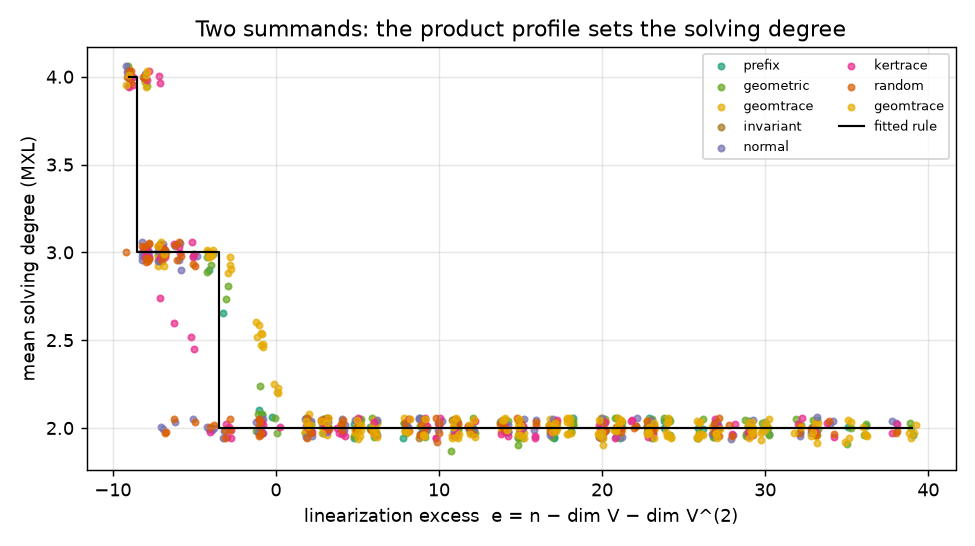
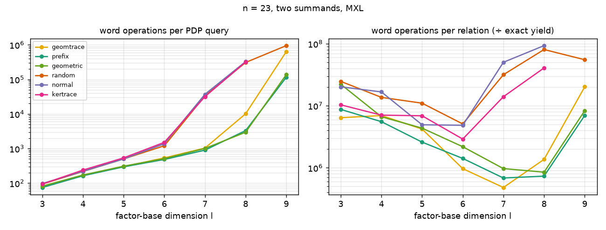

# Factor-base heuristics for point decomposition: yield and solving degree

An experiment, not a library feature.  It asks, for the summation-polynomial index
calculus on the ECC2K-130 curve family `y^2 + xy = x^3 + 1` over `F_2^n`, how the choice
of factor base changes the two numbers that price relation collection:

* **yield**: the probability that an ordinary subgroup target decomposes over the base;
* **difficulty**: the degree at which a Gröbner-type solver settles one point-decomposition
  query (PDP), and the work that costs.

It measures both exactly on small fields, for seven factor-base families at matched size,
and turns what it finds into heuristics that can be computed from the factor base
alone.  It also provides an online monitor for a relation-collection run.

**Summary of findings** (details and uncertainties below):

1. **For two summands, one structural number sets the solving degree.** Call
   `e = n − dim V − dim V^(2)` the linearization excess, where `V^(2)` is the span of
   products of pairs of elements of `V`.  Over 530 factor bases (7 families, 9 fields),
   the closure (F4/MutantXL-style) solving degree is
   `D = 2 + [e < −4.5] + [e < −8.5]`.  Its mean absolute error is 0.06 degrees, and 0.08
   when each field size is held out in turn.  Plain XL follows a similar rule
   (error 0.16).  Degree 2 means linear algebra on the equations, closed under multiplying
   the fallen linear polynomials by variables.
2. **The factor base controls `e`, and geometric progressions are optimal.** For prime `n`,
   `dim V^(2) ≥ 2l − 1`, and below `n − 1` only the progressions `c·span{1, g, …, g^(l−1)}`
   attain it.  The literature's `span{1, z, …, z^(l−1)}` is one of them.  In the cells where
   the rule puts a random base a degree higher, the progressions are 15–40 times cheaper
   per query and per relation on average, and up to 100 times.  Elsewhere they are
   1.5–2 times cheaper.  The yield is the same.
3. **Yield and degree are separate levers, and they combine.** The mean number of
   decompositions is fixed exactly by `|F|` and the classes of factor-base points in
   `E/⟨G⟩`.  The naive `|F|^m/#E` is off by up to 2.2×, and a Poisson step turns the mean
   into `P(decomposable)` to within 2–3%.  The yield does not follow the product profile.
   A progression placed inside `ker(Tr)` (family `geomtrace`) keeps the minimal profile and
   gets the kernel-of-trace doubling of the yield.
4. **The degree of regularity is the wrong proxy here.** The homogeneous degree of
   regularity of these systems is exactly `l + 1`, because the two-summand top parts are
   bilinear across the variable blocks.  The solving degree is 2–4.  The semi-regular
   prediction misses the solving degree by 0.5–1.2 degrees on average.  The first fall
   degree is the base degree for 95% of queries, whatever the base.
5. **For three summands the formulation decides whether the factor base matters.**
   In the direct formulation (unknowns are the coordinates of the `x_i`) the solving degree
   is set by the system's size.  The family moves it by at most one degree, and only for
   large `n`.  In the symmetric formulation (unknowns are the coordinates of
   `e_k ∈ V^(k)`, as in FPPR and WDSat), the number of unknowns *is*
   `Σ_k dim V^(k)`, and structured bases are several hundred times cheaper per query.

None of this is an IC result: every row is a PDP-stage profile (`candidate_id: null`), and
the toy fields are far from ECC2K-130.  Section 8 lists what would have to hold at scale.

## 1. Quick start

```sh
cd experiments/pdp-degree-heuristics
python3 -m pytest -q                         # 22 tests, ~3 s (numpy; gcc builds pdpkernel.c on first use)

# profile factor bases on one curve and one frozen target workload
python3 profile.py --n 23 --m 2 --l 6,7,8 --families prefix,geomtrace,random --seeds 1 \
    --targets 48 --planted 8 --out /tmp/profile.jsonl
# the symmetric (e_k in V^(k)) formulation of the same question
python3 profile.py --formulation sym --n 31 --m 3 --l 3 --families prefix,random --seeds 1 --targets 16

# a complete relation collection with the online monitor (logs solved mod r and verified)
python3 monitor.py collect --n 19 --m 2 --l 6 --family geomtrace --mode mxl --report-every 2000

# tables, figures and the n = 131 structure-only predictions
python3 heuristics.py results/*.jsonl --n131 --report REPORT.md --update-readme README.md
python3 figures.py results/*.jsonl
```

`sweep.sh`, `sweep_sym.sh`, `sweep_extra.sh` and `collect.sh` regenerate every receipt
under `results/`.  They resume, skipping factor bases already recorded.  `REPORT.md` has
every measured cell; this file shows a selection.

## 2. What is measured

**Curves.**  The Koblitz curve `y^2 + xy = x^3 + 1` over `F_2^n` for prime `n` from 13 to 47
(polynomial basis modulo the first irreducible trinomial or pentanomial, as in
`../pdp-scaling`).  The group order comes from the Frobenius trace.  The DLP subgroup is the
largest prime factor `r` of `#E`, with cofactor `h` (4 for n = 13, 19, 23, 41; larger
otherwise).  Every curve carries its AGENTS.md curve ID, `EC1N<n>Ckb1h<12hex>`.

**Factor bases.**  `F_V = {P : x(P) ∈ V}` for an `l`-dimensional subspace `V`.  The families:

| family | `V` | product profile `dim V^(k)` |
|---|---|---|
| `prefix` | `span{1, z, …, z^(l−1)}` | minimal: `k(l−1)+1` |
| `geometric` | `c·span{1, g, …, g^(l−1)}`, random `c, g` | minimal |
| `geomtrace` | a geometric progression inside `ker(Tr)`: `c` solves `Tr(c·g^j) = 0` | minimal |
| `normal` | `span{β, β^2, …, β^(2^(l−1))}` for a normal element `β` | generic |
| `kertrace` | a random subspace of `ker(Tr)` (every point in `2E`) | generic |
| `random` | a uniform random subspace | generic, `min(n, C(l+k−1, k))` |
| `invariant` | a Frobenius-stable subspace (`n = 31`: dims 5, 6) | — |

A point is usable when its `r`-component `π_r(P) = [h·(h⁻¹ mod r)]P` is not the identity.
Its relation-matrix column is the `±`-orbit of `π_r(P)`, and also the `τ`-orbit when `V^2 = V`.
Each receipt records `B` (usable points before folding, the `fb<B>` count), the geometric
point count, the strict-subgroup count and the folded column count separately, plus the
SHA-256 of the enumerated point set.

**Workloads.**  Per curve, a frozen list of ordinary targets `R = [k]G` with `k` uniform on
`[1, r−1]`.  Every factor base of that curve sees the same list, and the workload ID
(first 12 hex digits of SHA-256 over the canonical workload record) is in every row.
Planted targets (sums of `m` usable factor-base points in `⟨G⟩`) are correctness controls
and supply the degree distribution of satisfiable queries.  They are never used as a yield
estimate.

**Two PDP formulations.**  *Direct*: `S_{m+1}(x_1, …, x_m, x(R))` Weil-descended over any
basis of `V`, giving `N = m·l` Boolean unknowns and `n` equations of degree ≤ `m(m−1)`.  For
`V = span{1..z^(l−1)}` this is exactly `../pdp-scaling/descend.py`.  *Symmetric*:
`S_{m+1}` rewritten in `e_k = σ_k(x_1, …, x_m)`, each `e_k` expanded over a basis of `V^(k)`.
That gives `N_e = Σ_k dim V^(k)` unknowns.  A solution counts only if
`T^m + e_1 T^(m−1) + … + e_m` splits over `V`; each `e`-solution costs one splitting check.
For `m = 2` the symmetric system is linear, and for `m = 3` it is quadratic.

**Yield.**  Exact: all sums of `m` factor-base points are enumerated, and those in
`⟨G⟩ − {O}` are counted.  This gives `P(decomposable)` and the mean number of ordered
decompositions over *every* subgroup target, with no sampling.  An independent point-sum
oracle checks every sampled target against the algebraic route (descent, Möbius solution
set, lifting); they agree on every target of every run.

**Degrees.**  With `R_D` the row space of the Macaulay matrix `{x^a f_i : |a| + deg f_i ≤ D}`
over `F_2[x]/(x_i^2 + x_i)`, and columns in grevlex order:

* `FFD`, the first degree with `dim(R_D ∩ P_{<D}) > dim R_{D−1}`, a genuinely new
  lower-degree polynomial;
* `D_solve` (XL), the least `D` at which `R_D` contains a Gröbner basis: the Caminata–Gorla
  solving degree.  It is tested exactly: the ideal is radical with a known number `S` of
  solutions, so the test is whether the monomials divisible by no leading monomial number
  exactly `S`.  `S = 0` is a refutation (`1 ∈ R_D`);
* `D_solve` (MXL), the same test on the closure of `R_D` under multiplication by variables
  within degree `D`.  Polynomials that fall below `D` are multiplied again at the same degree,
  which is what MutantXL and the step degree of an F4 run do;
* `D_reg`, the first degree at which the top-degree parts generate every monomial in
  `F_2[x]/(x_i^2)`, set beside the semi-regular prediction `(1+t)^N / Π(1 + t^{d_i})`.

For refutations and unique solutions, which is almost every collection query, `D_solve` is
exactly where an XL or MXL solver stops.  Its cost is charged in **64-bit word XORs in
elimination plus monomial insertions in row building**, counted by the kernel.  The
brute-force solution count that certifies the GB test is recorded separately, as
instrument time.  CryptoMiniSat on the same systems (the `pdp-scaling` CNF-XOR encoding) is
timed as a second, independent difficulty measure.

## 3. The heuristics, and why they should work

**Product profile.**  The symmetric functions `e_k` of `m` factor-base abscissae lie in
`V^(k)`.  For a prime `n` the field has no intermediate subfields, so Hou, Leung and Xiang's
field analogue of Kneser's theorem gives `dim V^(k) ≥ min(n, k(l−1)+1)`.  Bachoc, Serra and
Zémor's analogue of Vosper's theorem shows that, below `n − 1`, equality at `k = 2` forces `V`
to be a geometric progression.  So "a factor base with the smallest product profile"
means exactly "a shifted geometric progression".  The free parameters `(c, g)` can then be
spent on other properties: the trace, the liftable count, Frobenius alignment.

**Linearization rank, two summands.**  `S_3 = e_2^2 + e_1^2 X^2 + e_2 X + b`.  Its
target-independent pieces span a space of Boolean functions of dimension
`ω = 1 + dim V + dim V^(2)`, and every target's `n` equations lie in that space
(`descent.Pieces.structure`).  When `e = n − (ω − 1) > 0` the equations are linearly
dependent there.  So a non-decomposable target is refuted by plain linear algebra with
probability about `1 − 2^−(e+1)`, and otherwise the fallen linear equations pin `e_1`, which
makes `e_2 = x_1(x_1 + e_1)` linear in `x_1`.  In the symmetric formulation the same number
appears as the unknown count, `N_e = ω − 1`, with `2^(N_e − n)` splitting checks per query.

**Yield.**  Sums of `m` factor-base points land in `⟨G⟩ ⊕ ⟨ψ(F)⟩` with `ψ(P) = [r]P`.  Taking
the `r`-component of a sum as uniform gives `E[#ordered decompositions] = T_ψ / r`.  Here
`T_ψ` counts ordered `m`-tuples whose `ψ` images cancel, and it is computed exactly from the
classes.  For a trace-kernel base every point lies in `2E`, so `T_ψ` doubles.

**Online monitor.**  During collection, `CollectionMonitor` keeps:

* the yield per attempt, with a Wilson interval and a Beta prior at the predicted yield;
* the novel-row fraction;
* the solving-degree mix by outcome, and its drift from the prediction;
* the cost per attempt, per relation and per novel row, with bootstrap intervals;
* the abort degree that minimizes cost per relation;
* the projected attempts to full rank, with a standard deviation.

The projection treats full rank as an unequal-probability coupon collector over the
exact per-column hit rates, `E[T] = ∫ (1 − Π_j(1 − e^(−λ_j t))) dt`, and falls back to the
observed rank-deficit rate when that is larger.

## 4. Two summands: the product profile sets the degree

<!-- BEGIN SEL_M2 -->
<!-- END SEL_M2 -->





Structured (prefix, geometric) against random bases, over every matched cell (same curve,
workload and `l`; ratios are geometric means over cells; censored cells excluded):

<!-- BEGIN PAIRED -->
<!-- END PAIRED -->

## 5. Heuristics that held up

Accuracy of the structure-only degree predictors, against the measured mean solving
degree per factor base:

<!-- BEGIN PREDICTORS -->
<!-- END PREDICTORS -->

A step rule on the linearization excess alone, with thresholds fitted by least squares
and scored with each field size held out in turn:

<!-- BEGIN RULES -->
<!-- END RULES -->

The predicted probability of refutation at the base degree, from `ω`, against the
measured rate.  The model is plain linear algebra on the equations, which is XL's base
event; the closure refutes more.

<!-- BEGIN BASE -->
<!-- END BASE -->

Exact yield against the prediction, over every factor base:

<!-- BEGIN YIELD -->
<!-- END YIELD -->

Degree of regularity against solving degree (direct formulation; `D_reg` measured on the
first targets of each cell):

<!-- BEGIN DREG -->
<!-- END DREG -->

CryptoMiniSat on the same systems:

<!-- BEGIN SAT -->
<!-- END SAT -->

## 6. Three summands, and the symmetric formulation

Direct formulation:

<!-- BEGIN SEL_M3 -->
<!-- END SEL_M3 -->

Symmetric formulation (unknowns `e_k ∈ V^(k)`; random bases above 22 unknowns are
skipped, which is itself the effect):

<!-- BEGIN SEL_SYM_M3 -->
<!-- END SEL_SYM_M3 -->

<!-- BEGIN SEL_SYM_M2 -->
<!-- END SEL_SYM_M2 -->

<!-- BEGIN PAIRED_SYM -->
<!-- END PAIRED_SYM -->

## 7. Relation collection with the monitor

Complete collections to full rank with the closure solver, paired on curve and cell,
over independent target streams.  Every factor-base log is solved mod `r` and checked
against `[log]G`.  The last two columns score the monitor's projection made when half the
rank was reached.

<!-- BEGIN COLLECT -->
<!-- END COLLECT -->

## 8. What this predicts for ECC2K-130 (prediction, not measurement)

Structure-only numbers at `n = 131` (`heuristics.py --n131`).  The product profile is
exact.  The two-summand `ω` uses the identity checked at toy sizes.  The decomposition
counts use `|F| ≈ 2^l` and `#E = 4r`:

<!-- BEGIN N131 -->
<!-- END N131 -->

**How to use this when choosing a factor base and running collection.**

1. *Before collecting*, compute the product profile `dim V^(k)` for `k ≤ m`
   (`factor_base.product_profile`).  It is a few thousand field multiplications even at
   `n = 131`.  For two summands, `e = n − l − dim V^(2)` gives the solving degree through
   the fitted rule, and `ω` gives the probability that plain linear algebra refutes a
   query.  Both hold across every family measured here.
2. *Use a geometric progression*: for prime `n` it is the only way to minimize the
   profile.  Spend its free parameter `c` on yield.  With subgroup targets in `2E`, the
   trace-zero choice (`geomtrace`) doubles the yield for the same degree.  At `e ≈ 0` it
   behaves as if the excess were one lower.  Its points satisfy `Σ Tr(x_i) = Tr(x_R)`
   trivially, so the system loses that implied linear relation.
3. *Choose `l` just below a degree threshold.*  The yield grows about fourfold per unit of
   `l` (two summands).  The query cost grows slowly until `e` crosses a threshold, then
   jumps 10–100×.  The cheapest cost per relation is therefore at the largest `l` that
   keeps `e` above the next threshold: `l = 7`–`8` at `n = 23` for geometric progressions,
   against `l = 5`–`6` for random bases.
4. *During collection*, feed `CollectionMonitor` one record per query.
   * Compare the observed yield with the prediction: the Wilson interval should cover it.
   * Compare the observed degree with the rule; drift means the base is not behaving like
     its profile.
   * Abort queries at the degree its table recommends.
   * Read the time to full rank from the coupon-collector projection over the exact
     column rates, with its standard deviation.
5. *Do not steer by the degree of regularity or the first fall degree.*  The homogeneous
   `D_reg` is `l + 1` here, set by the block structure.  The first fall degree is the base
   degree in 95% of two-summand queries, whatever the base.  The semi-regular prediction
   is off by 0.6–0.8 degrees on average.
6. *Match the heuristic to the solver.*  The profile helps linear-algebra solvers.
   CryptoMiniSat on the direct CNF-XOR model gains only about 10% from it.  For three
   summands the direct model hides most of the effect, so profile the symmetric model
   too.

## 9. Conventions and what is not claimed

* Rows are **PDP-stage profiles**: `candidate_id: null`, labelled
  `PS1N<n>Ckb1fb<B>PDP<m>xl[sym]h<12hex>` over the factor-base and point-decomposition
  records (AGENTS.md).  Run IDs are `<PS1-id>W<workload>R<run>`.  Relation linear algebra
  and target descent are `none`, so no end-to-end cost or speedup is claimed.  The
  collection runs do solve the relation matrix and verify every factor-base log; target
  descent is still absent.
* `ops/relation` in the profile tables is **derived**: mean ordinary-query cost divided by
  the exact decomposition probability.  The collection table measures it.
* Each receipt keeps exclusive phase wall times (setup, factor base, precompute, queries,
  PDP per mode, relation check), the instrument costs, the SHA-256 of every source file
  and the kernel flags.
* The toy fields reach `n = 47` and `N ≤ 18` unknowns.  The step rule is an empirical fit
  in that range.  The `n = 131` table applies structure, not measured degrees, and says
  nothing about `m ≥ 3` degrees at scale.  Two summands cannot beat rho for any factor
  base, because the yield `≈ 2^(2l−n−1)` forces `2^(n+1−l)` queries.

## Reproduce

```sh
./sweep.sh && ./sweep_sym.sh && ./collect.sh && ./sweep_extra.sh   # every receipt in results/
python3 heuristics.py results/*.jsonl --n131 --report REPORT.md --update-readme README.md
python3 figures.py results/*.jsonl
```
