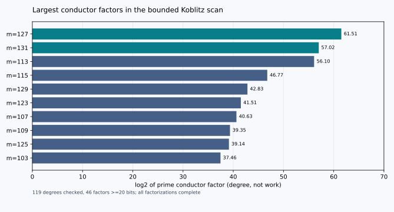
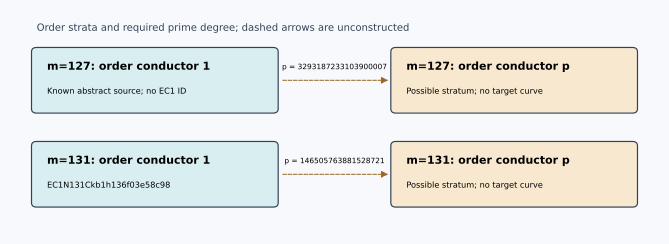

# Conductor gap scan, 2026-10-06 Pacific time

## Question and scope

Find ordinary curves whose Frobenius order admits a large prime gap from a
known source endomorphism order. This search scans the explicit family
`E_m: y² + xy = x³ + 1` over `F_(2^m)` for every integer `13 <= m <= 131`.
The model is abstract unless a specific field representation and EC1 ID are
identified. The source has maximal geometric endomorphism order of
discriminant `-7`: its degree-2 Frobenius `tau` satisfies
`tau² + tau + 2 = 0`, so `Z[tau]` is already maximal. Base extension keeps
that geometric maximal order. These facts establish `f_End(E_m) = 1`.

The method and all attempted rows are in
[`conductor-gap-scan-20261007.json`](conductor-gap-scan-20261007.json).
Run `python3 experiments/volcano-descendants-hardness/search_conductor_gaps.py
--min-degree 13 --max-degree 131 --min-gap-bits 20 --factor-timeout 2
--output <new-file>` to reproduce. It computes `tau^m = a_m + b_m tau`,
`q = 2^m`, `t_m = 2a_m - b_m`, and checks
`t_m² - 4q = -7 b_m²`. Thus `f_pi = |b_m|`. GNU `factor` proposes the
factorization; the program checks the product and each prime factor using
deterministic Miller-Rabin bases valid below `2^64`. The scan refuses partial
stratum claims when any factor is unresolved. The 119 factorizations here
are complete under that check. Threshold "20 bits" means bit length >=20.

| Requirement | Evidence and status |
|---|---|
| Search for large conductor gaps | 119 degrees, 46 prime-factor hits of at least 20 bits; complete in this declared family and range. |
| Establish a known source endomorphism conductor | `Z[tau]` has fundamental discriminant -7, hence conductor 1 for all sources. |
| Find actual curves on the far side of the largest gaps | Open: the scan identifies destination orders, not their models, j-invariants, or isogenies. |
| Show easier DLP or relation solving | Open: no target curves or comparative solver runs were produced by this scan. |

## Ranked findings

The order `O_p = Z + p O_K` is a candidate endomorphism order within the
ordinary isogeny class, with discriminant `-7p²`. The ratio of its class
number to the maximal order's class number is `p - (-7/p)` for these odd
primes. This ratio counts a stratum; it is not an estimate of navigation
work or discrete-log complexity.

| m | Largest prime p in f_pi | log2(p) | (-7/p) | h(O_p)/h(O_K) | Source / destination status |
|---:|---:|---:|---:|---:|---|
| 127 | 3293187233103900007 | 61.51419 | +1 | 3293187233103900006 | Source E_127 specified abstractly; destination order only |
| 131 | 146505763881528721 | 57.023735 | -1 | 146505763881528722 | Source `EC1N131Ckb1h136f03e58c98`; destination order only |
| 113 | 77031318395801969 | 56.096295 | -1 | 77031318395801970 | Source E_113 specified abstractly; destination order only |
| 107 | 1703265694433 | 40.631441 | +1 | 1703265694432 | Source E_107 specified abstractly; destination order only |
| 53 | 68476319 | 26.029102 | +1 | 68476318 | Source E_53 specified abstractly; destination order only |
| 83 | 53676929 | 25.677799 | -1 | 53676930 | Source E_83 specified abstractly; destination order only for this large prime |

For `m=127`, `f_pi = p` is itself prime and `#E =
170141183460469231707097688859690703316`. Its maximal-order source and
possible conductor-p stratum differ by one p-vertical step in the order
graph. The prime degree is about `2^61.51`; that number is the **degree of
the required prime edge**, not a running-time claim. The group order's
large-prime subgroup was not certified in this scan. No exact `EC1` record
exists for the abstract source representation; the destination curve and
route identifiers remain null.

For `m=131`, the exact source ID comes from
[`curves.yaml`](../ic-candidate-catalog/curves.yaml). The existing
[`degree-263 route record`](../ic-candidate-catalog/isogeny_routes.json)
constructs a different, small-prime descent. The p-stratum here remains an
unconstructed order, even though the m=131 class and the p factor have been
studied in the [ECC2K-130 isogeny class evidence](../ecc2k130-isogeny-class/README.md).
At `m=19`, `p=457` is a useful constructed control: the
[`volcano-ic` study](../volcano-ic/README.md) enumerated its 456 descendants.
At `m=83`, existing
[`volcano-m83` results](../../ecc2k130/research/volcano-m83/README.md)
inventory the conductor-6473 level; its 53676929 level remains a separate
construction question. The new scan does not supersede their measurements.

## Interpretation and open obligations

The conductor factor is a **candidate restricted-walk separation** for a
walk using only degrees excluding p. It does not establish hard navigation
for all algorithms or show that any destination curve has cheaper relations.
The next concrete obligations are to name a destination curve and verify its
endomorphism order, construct or certify an appropriate subgroup-preserving
map when claiming transfer, and compare verified relation cost or complete
DLP cost on paired instances. Charge construction, failed searches,
verification, and transport explicitly. Unknown maps and measurements are
null in the machine record.

The diagrams display order strata, not curve vertices. No new curve or
verified route is added to the canonical EC1 graph. I checked the existing
`experiments/volcano-ic/figures/` and
`experiments/ecc2k130-isogeny-class/report/pdf/fig_volcano.png`; neither
changes because this search constructs no new curve or route. The chart and
sketch beside this report are generated by
[`build_conductor_gap_report.py`](build_conductor_gap_report.py).

References: [Sutherland, *Isogeny volcanoes*](https://arxiv.org/abs/1208.5370)
for ordinary volcano levels and [the existing source curve record](../ic-candidate-catalog/curves.yaml)
for the exact m=131 identity. The equations, prime checks, and ranking are
reproducible calculations in the accompanying scripts and JSON, rather than
claims taken from these references.
